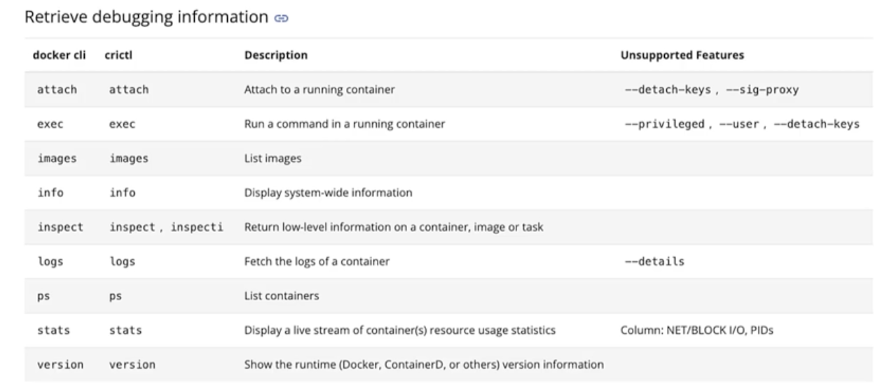
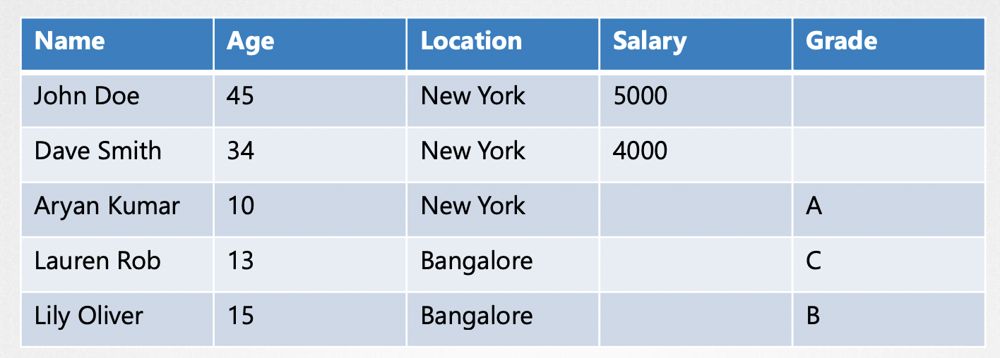
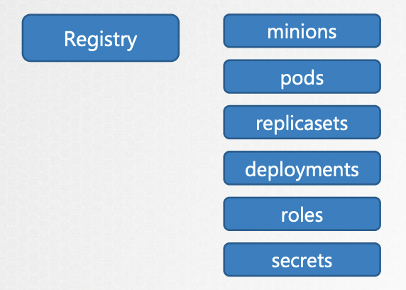

# Section 2: Core Concepts

[Kubernetes+-CKA-+0100+-+Core+Concepts.pdf](Section%202%20Core%20Concepts%20ee4084fc12ed4ad78bf3664c35859bda/Kubernetes-CKA-0100-CoreConcepts.pdf)

[kubernetes-services-updated.pdf](Section%202%20Core%20Concepts%20ee4084fc12ed4ad78bf3664c35859bda/kubernetes-services-updated.pdf)

[Core+concepts+-2.pdf](Section%202%20Core%20Concepts%20ee4084fc12ed4ad78bf3664c35859bda/Coreconcepts-2.pdf)

# 11. Cluster Architecture

**Master Node [*Control Ships*]**: Manage, Plan, Schedule, Monitor.

**ETCD Cluster**: A DB in a key-value format where the information about containers is stored.

**kube-scheduler [*Crane*]:** identifies conditions to choose which node is appropriate to place a container on.

**Controller-Manager [*Services Office*]**: in charge of comms between ships (nodes).

- Node-controller: controls nodes.
- Replication-Controller: checks if desired number of containers are running

 ********************************kube-apiserver [*HQ*]**: manages at a high level. Orchestrates operations between clusters.

**Worker Nodes [************Cargo Ships]**************: 

`**kubelet 선장**`

Every ship has a captain, who is responsible to organize containers. The captain is the **`kubelet`**. It is an agent that runs on each node in a cluster. It listens to the Kube API. 

**`Kube-proxy 무전기`**

선박(worker node)들끼리 통신하는 부분. 선박마다 있음.

Our applications are in the form of containers, so require container-compatibility.

We need a SW to run containers→**`container runtime engine`**→ Docker!

 


# 12. Docker vs ContainerD

도커랑 컨테이너D를 비교하는 경우가 많다. 왜 그런지 알기 위해서는 역사를 좀 알아야 한다.

### **컨테이너의 역사:**

태초에는 Docker만 존재했다. 

도커를 orchestrate하기 위해 쿠버가 탄생.

그러나, 도커 이외에 컨테이너 런타임 (예: rkt)와 호환이 돼야 했다. 

따라서 쿠버는 이걸 가능하게 하기 위해 `Container Runtime Interface (CRI)`를 제공하기 시작.

`Open Container Initiative (OCI)`

→ imagespec: image building specifications

→ runtimespec: defined how container runtime should be developed

OCI를 따르면 CRI로 호환이 되게 했음.

근데 도커는 CRI를 따르지 않았음! (도커가 훨씬 오래됐기 때문)

→`dockershim`: 도커 전용으로 호환이 되게 해주는거.

도커는 컨테이너 런타임이 전부가 아니라: docker CLI, docker API, 기타 등등을 포괄하는것.

도커의 개념 중에 컨테이너 런타임은 runC였으며, 이를 관리하는 daemon은 ContainerD.

ContainerD was CRI compatible → Kube compatible.

ContainerD와 도커를 개별적으로 사용 가능했다.

→ 따라서 dockershim은 없앴음.

즉, ContainerD와 도커가 분리됨.

그러면 기존에 docker cmd를 썼는데 이제 분리돼서 어떻게 ContainerD를 어떻게 썼는지?

ContainerD를 설치하면 `ctr`이라는 CLI가 같이 다운로드 되는데, 이게 성능이 별로임. 

따라서 `nerdctl`이라는 CLI라는 차선책이 생김.

- 도커 cmd 기능을 실행 할 수 있음.
- docker 대신 nerdctl 쓰면 됨.

그러면 `crictl`은 또 뭔데?

여러 컨테이너 런타임을 실행할 수 있는 CLI지만, Kube 중심적으로 만들어짐. 디버깅을 위해 활용되며, 따로 설치해야 된다. 

`crictl ps -a`처럼 쓰면 됨. 도커랑 매우 유사.

도커랑 다른 점은 crictl은 pods 접근 권한이 있는 점.



ctr → containerD와 호환, 디버깅용

nerdctl → containerD와 호환, 도커 CLI와 같은 기능 지원.

cricctl → kube community based, All CRI compatible.

**Kubernetes가 도커 버렸을 때:**

이미지 빌드 제공 O

컨테이너 런타임 제공 X

dockershim이 없어졌을 당시의 공식 article:

[https://kubernetes.io/blog/2020/12/02/dont-panic-kubernetes-and-docker/](https://kubernetes.io/blog/2020/12/02/dont-panic-kubernetes-and-docker/)

Admin들은 도커 사용X, 어플리케이션 개발자들 사용 O:

[https://www.linkedin.com/pulse/containerd는-무엇이고-왜-중요할까-sean-lee/?originalSubdomain=kr](https://www.linkedin.com/pulse/containerd%EB%8A%94-%EB%AC%B4%EC%97%87%EC%9D%B4%EA%B3%A0-%EC%99%9C-%EC%A4%91%EC%9A%94%ED%95%A0%EA%B9%8C-sean-lee/?originalSubdomain=kr)


# 13. ETCD For Beginners

### What is ETCD?

It is a distributed reliable key-value store that is simple, secure, and fast.

[https://etcd.io/](https://etcd.io/)

### What is a Key-Value Store?

원래는 tabular 형식을 따랐음. SQL처럼 table, row-based. 

따라서 새로운 column을 추가하면 빈 칸이 많아지는데, 이를 예방하기 위해서 K-V store이 탄생.



사람마다 하나의 파일처럼 생성. 하나의 파일을 바꿔도 다른것들이 안 바뀜. 대표적인 예시:JSON. 


Value 값들은 쿠버네티스에 어디서 저장되는가?

→ master node→ ETCD Cluster

### Operate ETCD

설치과정:

```bash
curl -L https://github.com/etcd-io/etcd/releases/download/v3.3.11/etcdv3.3.11-linux-amd64.tar.gz -o etcd-v3.3.11-linux-amd64.tar.gz

tar xzvf etcd-v3.3.11-linux-amd64.tar.gz
```

`./etcd` → Run ETCD Service

`./etcdctl set key1 value1` → 하나의 KV 값 추가하기

`./etcdctl get key1` → 값 불러오기 

**v2와 v3의 차이?**

RAFT consensus algorithm와 CNCF 인수 등 다양한 일로 버전이 생김.

→etcdctl 커맨드가 많이 바뀜.

check etcd version:

`./etcd --version`

change etcd version:

`export ETCDCTL_API=3 ./etcdtl version`

v3에서 추가하려면 set이 아니라 put:

`./etcdctl put key1 value1` → 하나의 KV 값 추가하기

# 14. ETCD in Kubernetes

ETCD data store는 cluster와 관련된 정보를 저장한다.

→ nodes, pods, configs, secrets, accounts, roles, etc

- [https://tech.kakao.com/2021/12/20/kubernetes-etcd/](https://tech.kakao.com/2021/12/20/kubernetes-etcd/)
    
    
    

kube control get 커맨드를 실행해서 얻는 모든 정보는 ETCD 서버로부터 받는다.

해당 장에서 두가지 Kube deployment를 다루는데: 

- deploy from scratch
- KubeADM tool

예제에서는 KubeADM tool을 사용하며, 나중에 가서는 scratch부터 구현한다함.

- [https://kubernetes.io/ko/docs/reference/setup-tools/kubeadm/](https://kubernetes.io/ko/docs/reference/setup-tools/kubeadm/)
    
    
    

실습을 하게 되면서 여러 설정을 다루게 되는데, 일단은 advertise-client-urls만 보면 된다.

**KubeADM를 사용해서 deploy 할 경우:**

etcd 서버를 POD로 배포.


Kube에 있는 모든 Key를 보고 싶으면:


kube는 정해진 형식을 따르면서 데이터를 저장한다.

root는 registry고 이후에 minions, pods, replicasets, deployments, roles, secrets.



High Availability (고가용성) Environment에서는 Cluster 내에 여러개의 Master Node가 존재할 것이다. 또한, 여러개의 ETCD 인스턴스가 여러개의 master node에 할당이 된다. 

# 15. ETCD - Commands (Optional)


1. Kube-API Server
2. Kube Controller Manager
3. Kube Scheduler
4. Kubelet
