# Section 2: Core Concepts

[Kubernetes+-CKA-+0100+-+Core+Concepts.pdf](Section%202%20Core%20Concepts%20ee4084fc12ed4ad78bf3664c35859bda/Kubernetes-CKA-0100-CoreConcepts.pdf)

[kubernetes-services-updated.pdf](Section%202%20Core%20Concepts%20ee4084fc12ed4ad78bf3664c35859bda/kubernetes-services-updated.pdf)

[Core+concepts+-2.pdf](Section%202%20Core%20Concepts%20ee4084fc12ed4ad78bf3664c35859bda/Coreconcepts-2.pdf)

# 11. Cluster Architecture

**Master Node [*Control Ships*]**: Manage, Plan, Schedule, Monitor.

**ETCD Cluster**: A DB in a key-value format where the information about containers is stored.

**kube-scheduler [*Crane*]:** identifies conditions to choose which node is appropriate to place a container on.

**Controller-Manager [*Services Office*]**: in charge of comms between ships (nodes).

- Node-controller: controls nodes.
- Replication-Controller: checks if desired number of containers are running

 ********************************kube-apiserver [*HQ*]**: manages at a high level. Orchestrates operations between clusters.

**Worker Nodes [************Cargo Ships]**************: 

`**kubelet 선장**`

Every ship has a captain, who is responsible to organize containers. The captain is the **`kubelet`**. It is an agent that runs on each node in a cluster. It listens to the Kube API. 

**`Kube-proxy 무전기`**

선박(worker node)들끼리 통신하는 부분. 선박마다 있음.

Our applications are in the form of containers, so require container-compatibility.

We need a SW to run containers→**`container runtime engine`**→ Docker!

 

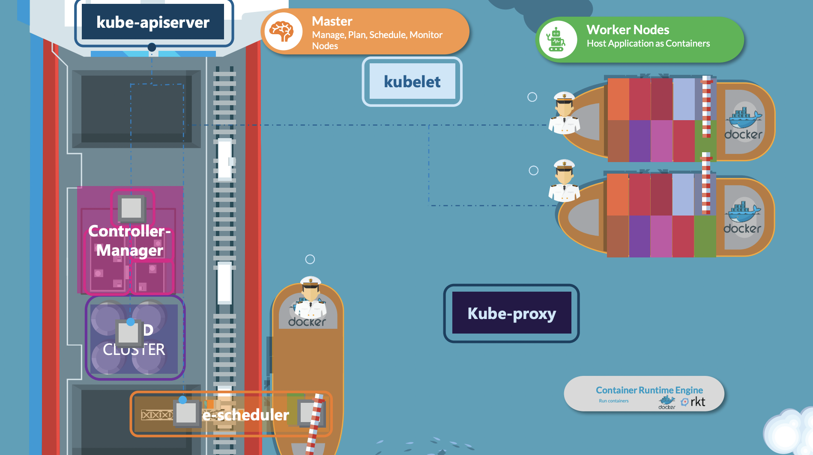


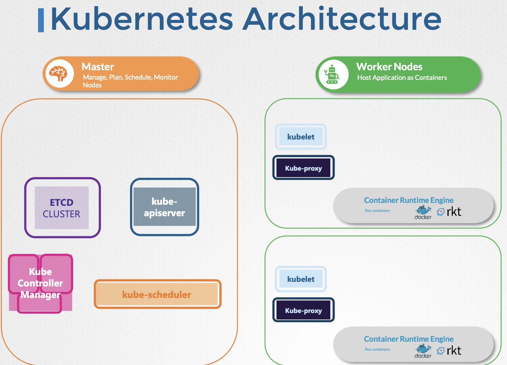

# 12. Docker vs ContainerD

도커랑 컨테이너D를 비교하는 경우가 많다. 왜 그런지 알기 위해서는 역사를 좀 알아야 한다.

### **컨테이너의 역사:**

태초에는 Docker만 존재했다. 

도커를 orchestrate하기 위해 쿠버가 탄생.

그러나, 도커 이외에 컨테이너 런타임 (예: rkt)와 호환이 돼야 했다. 

따라서 쿠버는 이걸 가능하게 하기 위해 `Container Runtime Interface (CRI)`를 제공하기 시작.

`Open Container Initiative (OCI)`

→ imagespec: image building specifications

→ runtimespec: defined how container runtime should be developed

OCI를 따르면 CRI로 호환이 되게 했음.

근데 도커는 CRI를 따르지 않았음! (도커가 훨씬 오래됐기 때문)

→`dockershim`: 도커 전용으로 호환이 되게 해주는거.

도커는 컨테이너 런타임이 전부가 아니라: docker CLI, docker API, 기타 등등을 포괄하는것.

도커의 개념 중에 컨테이너 런타임은 runC였으며, 이를 관리하는 daemon은 ContainerD.

ContainerD was CRI compatible → Kube compatible.

ContainerD와 도커를 개별적으로 사용 가능했다.

→ 따라서 dockershim은 없앴음.

즉, ContainerD와 도커가 분리됨.

그러면 기존에 docker cmd를 썼는데 이제 분리돼서 어떻게 ContainerD를 어떻게 썼는지?

ContainerD를 설치하면 `ctr`이라는 CLI가 같이 다운로드 되는데, 이게 성능이 별로임. 

따라서 `nerdctl`이라는 CLI라는 차선책이 생김.

- 도커 cmd 기능을 실행 할 수 있음.
- docker 대신 nerdctl 쓰면 됨.

그러면 `crictl`은 또 뭔데?

여러 컨테이너 런타임을 실행할 수 있는 CLI지만, Kube 중심적으로 만들어짐. 디버깅을 위해 활용되며, 따로 설치해야 된다. 

`crictl ps -a`처럼 쓰면 됨. 도커랑 매우 유사.

도커랑 다른 점은 crictl은 pods 접근 권한이 있는 점.

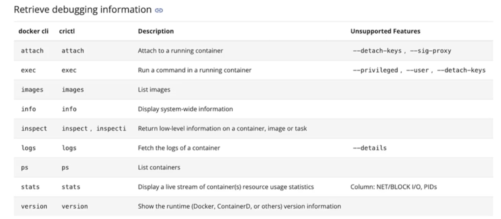

ctr → containerD와 호환, 디버깅용

nerdctl → containerD와 호환, 도커 CLI와 같은 기능 지원.

cricctl → kube community based, All CRI compatible.

**Kubernetes가 도커 버렸을 때:**

이미지 빌드 제공 O

컨테이너 런타임 제공 X

dockershim이 없어졌을 당시의 공식 article:

[https://kubernetes.io/blog/2020/12/02/dont-panic-kubernetes-and-docker/](https://kubernetes.io/blog/2020/12/02/dont-panic-kubernetes-and-docker/)

Admin들은 도커 사용X, 어플리케이션 개발자들 사용 O:

[https://www.linkedin.com/pulse/containerd는-무엇이고-왜-중요할까-sean-lee/?originalSubdomain=kr](https://www.linkedin.com/pulse/containerd%EB%8A%94-%EB%AC%B4%EC%97%87%EC%9D%B4%EA%B3%A0-%EC%99%9C-%EC%A4%91%EC%9A%94%ED%95%A0%EA%B9%8C-sean-lee/?originalSubdomain=kr)

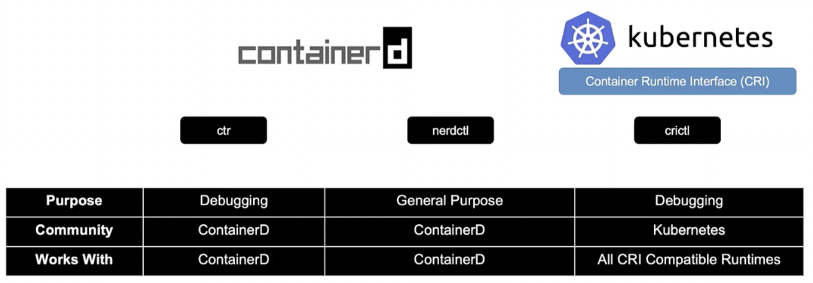

# 13. ETCD For Beginners

### What is ETCD?

It is a distributed reliable key-value store that is simple, secure, and fast.

[https://etcd.io/](https://etcd.io/)

### What is a Key-Value Store?

원래는 tabular 형식을 따랐음. SQL처럼 table, row-based. 

따라서 새로운 column을 추가하면 빈 칸이 많아지는데, 이를 예방하기 위해서 K-V store이 탄생.

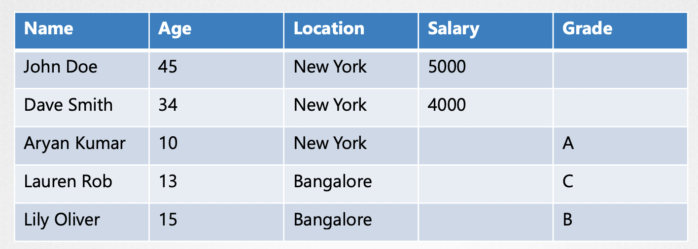

사람마다 하나의 파일처럼 생성. 하나의 파일을 바꿔도 다른것들이 안 바뀜. 대표적인 예시:JSON. 

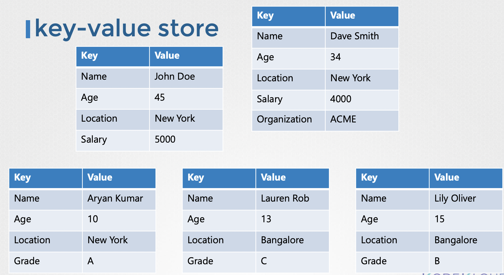

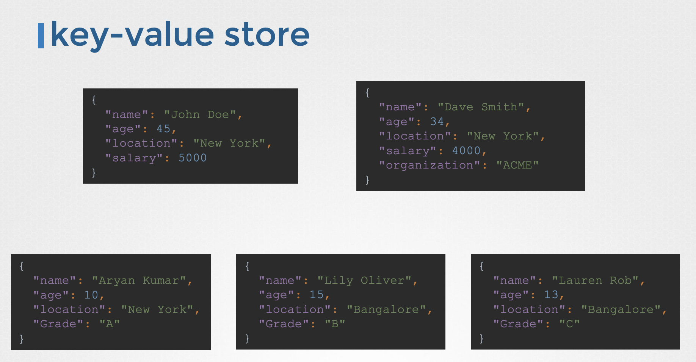

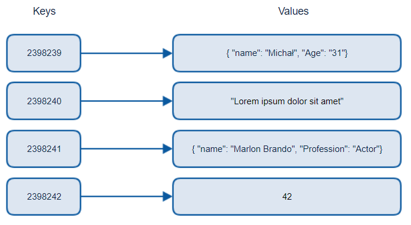

Value 값들은 쿠버네티스에 어디서 저장되는가?

→ master node→ ETCD Cluster

### Operate ETCD

설치과정:

```bash
curl -L https://github.com/etcd-io/etcd/releases/download/v3.3.11/etcdv3.3.11-linux-amd64.tar.gz -o etcd-v3.3.11-linux-amd64.tar.gz

tar xzvf etcd-v3.3.11-linux-amd64.tar.gz
```

`./etcd` → Run ETCD Service

`./etcdctl set key1 value1` → 하나의 KV 값 추가하기

`./etcdctl get key1` → 값 불러오기 

**v2와 v3의 차이?**

RAFT consensus algorithm와 CNCF 인수 등 다양한 일로 버전이 생김.

→etcdctl 커맨드가 많이 바뀜.

check etcd version:

`./etcd --version`

change etcd version:

`export ETCDCTL_API=3 ./etcdtl version`

v3에서 추가하려면 set이 아니라 put:

`./etcdctl put key1 value1` → 하나의 KV 값 추가하기

# 14. ETCD in Kubernetes

ETCD data store는 cluster와 관련된 정보를 저장한다.

→ nodes, pods, configs, secrets, accounts, roles, etc

- [https://tech.kakao.com/2021/12/20/kubernetes-etcd/](https://tech.kakao.com/2021/12/20/kubernetes-etcd/)
    
    
    

kube control get 커맨드를 실행해서 얻는 모든 정보는 ETCD 서버로부터 받는다.

해당 장에서 두가지 Kube deployment를 다루는데: 

- deploy from scratch
- KubeADM tool

예제에서는 KubeADM tool을 사용하며, 나중에 가서는 scratch부터 구현한다함.

- [https://kubernetes.io/ko/docs/reference/setup-tools/kubeadm/](https://kubernetes.io/ko/docs/reference/setup-tools/kubeadm/)
    
    
    

실습을 하게 되면서 여러 설정을 다루게 되는데, 일단은 advertise-client-urls만 보면 된다.

**KubeADM를 사용해서 deploy 할 경우:**

etcd 서버를 POD로 배포.

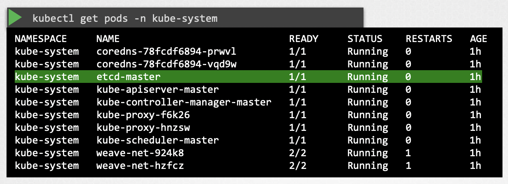

Kube에 있는 모든 Key를 보고 싶으면:

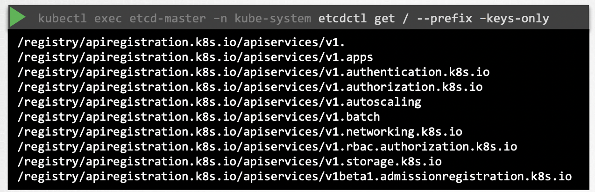

kube는 정해진 형식을 따르면서 데이터를 저장한다.

root는 registry고 이후에 minions, pods, replicasets, deployments, roles, secrets.

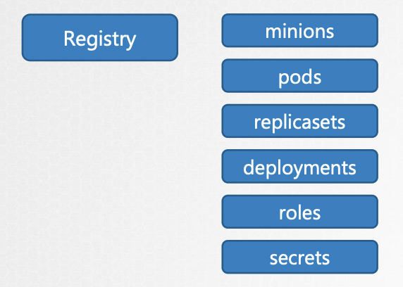

High Availability (고가용성) Environment에서는 Cluster 내에 여러개의 Master Node가 존재할 것이다. 또한, 여러개의 ETCD 인스턴스가 여러개의 master node에 할당이 된다. 

# 15. ETCD - Commands (Optional)

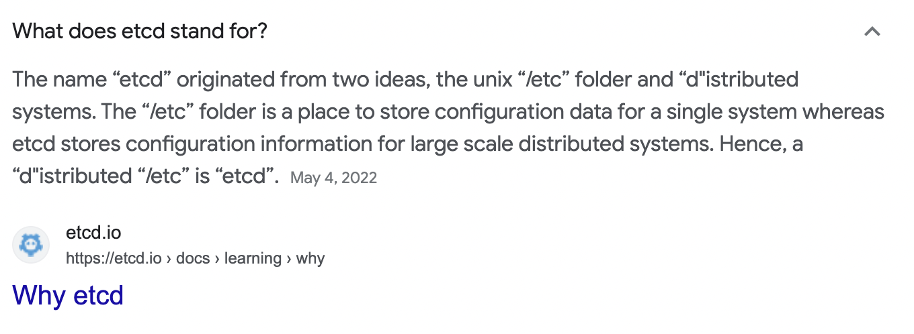

1. Kube-API Server
2. Kube Controller Manager
3. Kube Scheduler
4. Kubelet


# 16. Kube-API Server

역할 -

- 클러스터의 주요 관리 컴포넌트
- 사용자 요청을 인증하고 검증
- etcd 클러스터에서 데이터 검색 및 업데이트

동작 방식 -

- `kubectl` 명령어 실행 시, 실제로 kube-apiserver에 연결
    - kube-api server는 요청을 인증하고 검증한 후 etcd에서 데이터를 검색하여 응답
        
        
        
- 직접 api를 호출하여 작업도 가능
    - kube-api server가 새로운 pod object를 생성. 
    pod 생성 요청 시 kube-api server는 etcd 정보를 업데이트 하고, 스케줄러와 kubelet 등 다른 컴포넌트와 연동.


설정 및 실행:

- kube-api server는 많은 파라미터와 함께 실행
- 클러스터 구성 시 사용되는 인증서, 암호화 및 보안 옵션 포함
- etcd 서버 위치 등 주요 정보 설정 필요
- 설치 방식에 따라 설정 확인 방법이 다름 (kubdeadmin 사용여부)

 

# 17. Kube Controller Manager

역할 -

- Kubernetes 내의 다양한 컨트롤러를 관리
- 컨트롤러는 시스템의 특정 부분을 모니터링하고 조치


Node Monitor Period = 5s → 5초 마다 pod의 상태를 체크

Node Monitor Grace Period = 40s → 40초동안 pod에서의 수신을 받지 못하면 UNREACHABLE

POD Eviction Timeout = 5m → 백업 할 수 있는 시간. 백업 하지 않을 시, removes the PODS assigned to that node and provisions them on the healthy ones if the PODS are part of a replica set.

- pod 개수는 유지되어야 하므로, 죽은 노드(컴퓨터)에 있던 pod는 죽이고 그 개수만큼 정상 노드들에 분산 배포함(프로비저닝)


Kube Controller Manager의 구성 및 위치

- 모든 컨트롤러는 Kube Controller Manager 프로세스에 패키지됨
- 설치 시 여러 컨트롤러도 함께 설치됨

# 18. Kube Scheduler

역할 -

- Kubernetes에서 Pod가 어느 노드에 배치될지 결정.
    - 실제로 pod를 노드에 배치하는 것은 kubelet의 역할.

Kube-scheduler의 필요성

- 다양한 크기와 목적의 컨테이너와 노드 (또는 선박) 간 최적의 매칭을 위해


스케줄링 과정

- 필터링 단계: pod의 요구 사항에 맞지 않는 노트 필터링
- 랭킹 단계: 필터링된 노드 중 최적의 노드 선정

# 19. Kubelet

역할 -

- Kubernetes worker nodes에서의 주요 구성 요소로, ship의 선장과 같은 역할을 한다. (배에 있는 컨테이너의 상태를 주기적으로 보고, master로부터 지시를 받아 컨테이너를 로드 또는 언로드)


- Kubernetes cluster에 node를 등록.
- Master의 지시를 받아 컨테이너 또는 pod를 생성하고 로드할 때, Docker와 같은 컨테이너 런타임 엔진에 필요한 이미지를 요청하고 인스턴스를 실행.
- 주기적으로 Node & Pod의 상태를 모니터링.

# 20. Kube Proxy

역할 -

클러스터 내의 pods이 서로 통신할 수 있게 하는 중요한 컴포넌트.


Pod network: 클러스터의 모든 노드에 걸쳐 확장되는 내부 가상 네트워크.

Service: Pod의 IP 주소가 항상 동일하다는 것을 보장 X. 서비스를 통해, 다양한 Pods들을 안정적으로 연결하고 접근할 수 있게 된다.

kube-proxy의 필요성:

- Kubernetes cluster의 각 node에서 실행되는 프로세스.
- 새로운 service가 생성될 때마다 해당 service로의 traffic을 backend pod으로 전달하도록 각 node에 규칙을 생성.

동작 방식:

- IP tables 규칙을 사용하여 이를 수행.
- Service의 IP address로 오는 traffic을 실제 pod의 IP address로 전달하도록 IP tables 규칙을 생성한다.

# 21. Pods

Kubernetes에서는 컨테이너를 직접적으로 배포하는 대신, Pods라는 개체안에 컨테이너를 encapsulate하여 배포한다.

Pods:

- Kubernetes에서 생성할 수 있는 가장 작은 단위.
- 각 Pods은 애플리케이션의 단인 인스턴스를 나타냄.


Scaling:

- 사용자가 증가할 경우 추가적인 Pods을 생성하여 애플리케이션을 스케일링할 수 있다.
- 한 Pod 안에 추가 컨테이너를 넣어 스케일링하는 것이 아니라, 새로운 Pod을 추가하는 것이다.


Multi Container Pods:

- 하나의 Pod엔은 여러 containers가 있을 수 있다.
- 이런 구조는 Helper container가 주 애플리케이션 container를 지원해야하는 경우에 사용된다.


# 22. Pods with YAML

pod-definition.yml

must include the following:

```bash
apiVersion:
kind:
metadata:
	name:
	labels:
		app:
		type:
spec:
	containers:
		- name: nginx-container
			image: nginx
```

kind is the type of object to be made (ex:pod)

metadata: names, labels, type, etc (form is dictionary) type is key-value pair

- indicates that this is the first item in the list.

creating a pod:

`kubectl create - f pod-definition.yml`

view pods:

`kubectl get pods`

view detailed information about pods:

`kubectl describe pod myapp-pod`

# 23. Demo - Pods with YAML

Instead of using the kubectl run command, we run the pod using the YAML definition file.

vim pod.yaml

```bash
apiVersion: v1
kind: Pod
metadata:
  name: nginx
  labels:
    app: nginx
    tier: frontend
spec:
  containers:
	- name: nginx
    image: nginx
  - name: busybox
    image: busybox
```

2 spaces instead of tab

`cat pod.yaml` to check that the file was created properly.

`kubectl apply -f pod.yaml`

-f (file name)

apply can be used instead of create

check status:

`kubectl get pods`

check more details of pod:

`kubectl describe pod nginx`

Create a new pod with the `nginx` image.

`kubectl run nginx --image=nginx`

# 29. ReplicaSets

### Replication Controller

> **What is a replica and why do we need replication controllers?**
> 

When a pod crashes, we don’t want users to lose access and therefore we have more than one instance/pod running at the same time.

The Replication Controller allows us to have more than one instance of a single pod in the Kube cluster, providing `High Availability (고가용성)`.

Even when there is only one pod, the Replication Controller can automatically bring up a new pod when it fails.

The Replication Controller ensures that the specified number of pods are running at all times, be it 1 or 100.

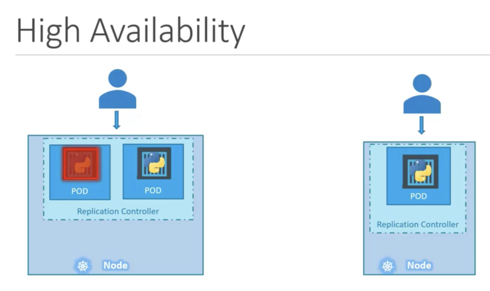

> **Load balancing and scaling**
> 

We also need Replication Controllers to create multiple pods to share the load across them.

When the amount of users increases, we deploy additional pods in the node. When even more users increase such that the node cannot handle it, we can deploy more pods across multiple nodes in the cluster, providing `scalability (확장성)`.

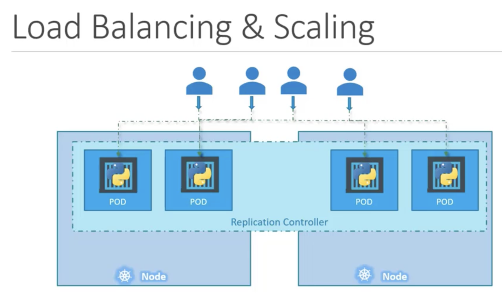

> **Replication Controller vs Replica Set**
> 

Replication Controller and the Replica Set provide the same purpose but the replica controller is the older version while the replica set is the newer recommended way.

### Creating a Replication Controller

1. Start by creating a replication controller definition yaml file. rc-definition.yml.
    
    ```yaml
    apiVersion: v1
    kind: ReplicationController
    metadata:
      name: myapp-rc
      labels:
        app: myapp
        type: front-end
    spec:
      template: 
        [ALL INFO REGARDING POD]
      replicas: 3
    ```
    
    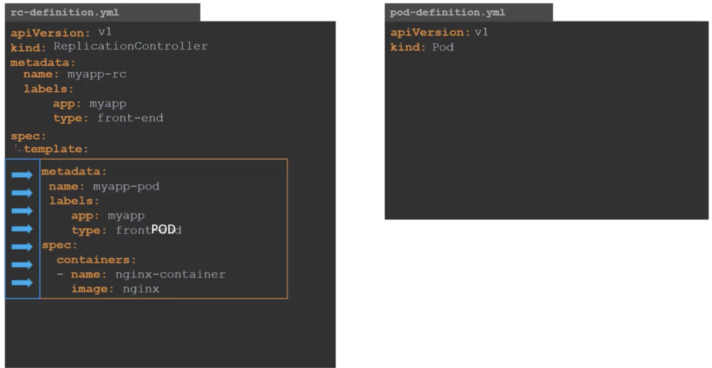
    
    The replication parent is the parent and the pod is the child.
    
2. `kubectl create -f rc-definition.yml` to create the replication controller.
3. `kubectl get replicationcontroller` to view the amount of replication controllers created
4. `kubectl get pods` to view the pods created by the RC.

### Creating a Replica Set

1. Start by creating a replication controller definition yaml file. replicaset-definition.yml.
    
    ```yaml
    apiVersion: apps/v1 # NOT just v1
    kind: ReplicaSet
    metadata:
      name: myapp-replicaset
      labels:
        app: myapp
        type: front-end
    spec:
      template: 
        [ALL INFO REGARDING POD]
      replicas: 3
      selector: 
    #replicaset NEEDS THIS
    #specifies which pods fall under the RS. Needs it because RS can also manage pods that weren't created by it.
    ```
    
    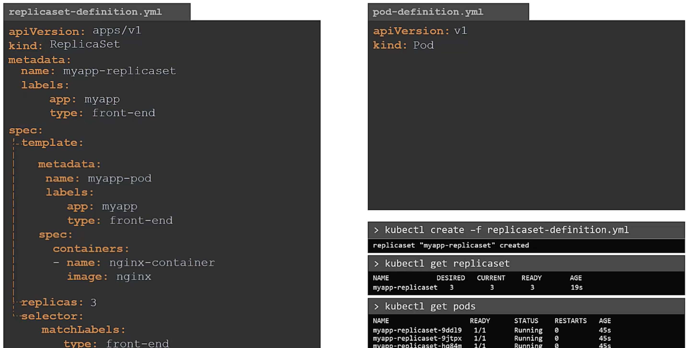
    
2. `kubectl create -f replicaset-definition.yml` to create the replicaset.
3. `kubectl get replicaset` to view the amount of replica sets created
4. `kubectl get pods` to view the pods created by the RS.

### Labels and Selectors

Why do we even label our pods?

The ReplSet monitors our pods. However, if there are a lot of pods to monitor, it might not know which pods to monitor. Labeling helps this.

The labels work as a filter to check which pods to monitor.

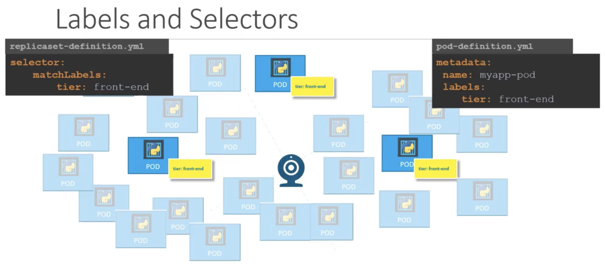

### Scale

How do we modify the amount of replicas to scale? (For example from 3 to 6 replicas).

Method 1: Change yaml file and run the `kubectl replace -f replicaset-definition.yml` to update it.

Method 2: `kubectl scale --replicas=6 -f replicaset-definition.yml` (same yml file) or `kubectl scale --replicas=6 replicaset myapp-replicaset` (type-name format).

However the scale command will not change the original definition.yml code.

### Commands

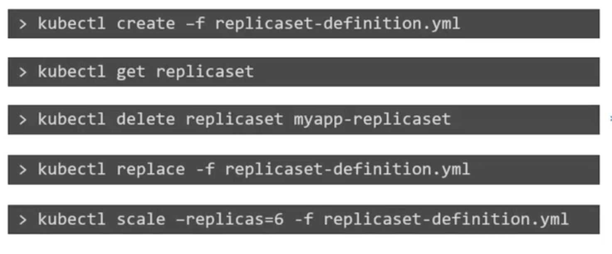

# 30. PracticeTest - ReplicaSets

- **Problems**
    1. view pods → kubectl get pods
    2. view replsets → kubectl get replicaset
    3. view replset info → kubectl describe replicaset
    4. view pod info → kubectl describe pods
    5. delete pod → kubectl delete pod <pod-name>
    6. problem: replicaset apiVersion uses `apps/v1`
        
        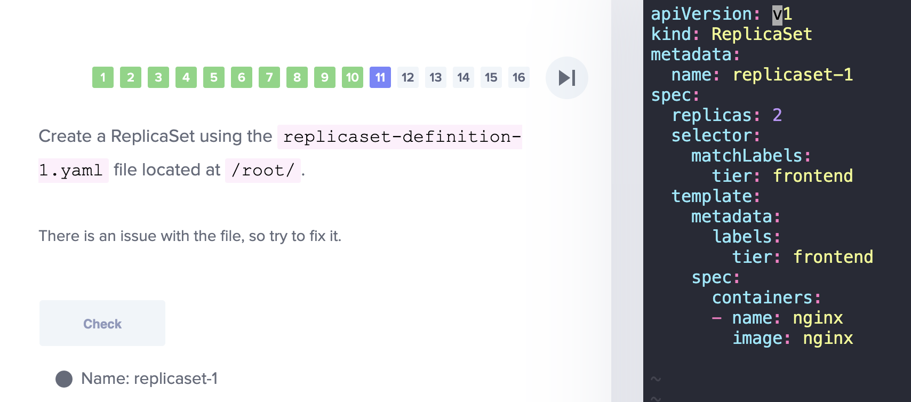
        
    7. problem: labels don’t match.
        
        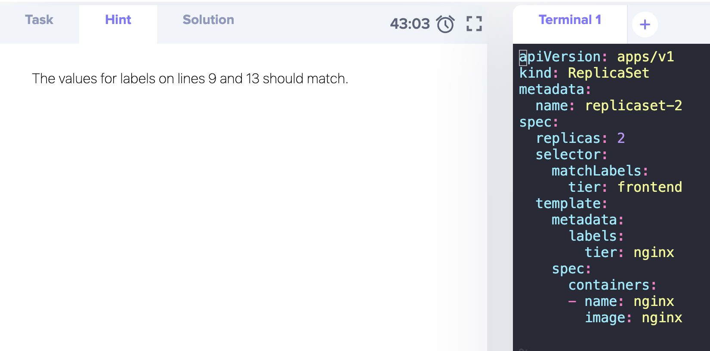
        
    8. delete both replica sets → `kubectl delete replicaset <replicasetname>`
    9. Use the command `kubectl edit` to edit the existing running replicaset.
    10. Scale the ReplicaSet to 5 PODs → Use `kubectl scale rs new-replica-set --replicas=5`

# 31. Solutions (skip)

# 32. Deployments

### Why we need Deployments

1. We need many instances of a web server.
2. We want to upgrade our docker instances, but not all of them at once since this can affect performance.
- Rather, we want to ugrade them one by one (also called `rolling updates`)
1. We also want to be able to rollback the recent changes in case of errors.
2. We want apply a pause to our environment when several changes were made, not apply them immediately.

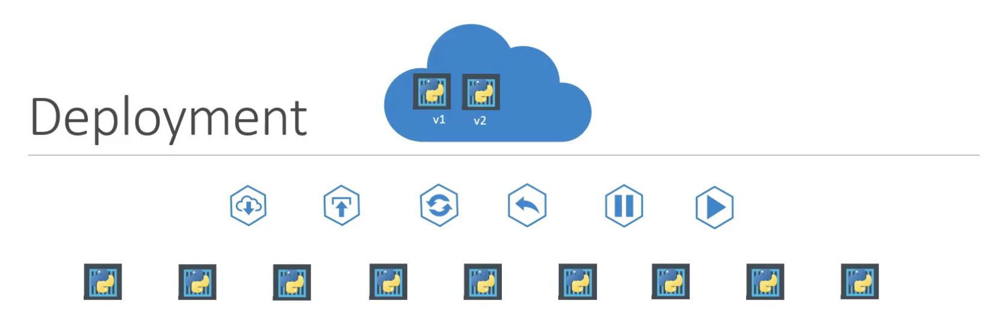

### Pods
- In this course, pods deploy single instances of our applications.
- Each container is encapsulated in pods.
- Multiple pods are deployed using replication controllers/replica sets.
- ABOVE that exists `deployment`, a kube object that allows us to upgrade the underlying instances seamlessly using: rolling updates, undo changes, pause, resume changes.
    
    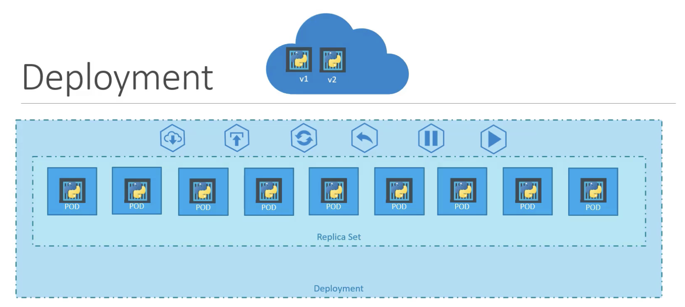
    

### Defining Deployments

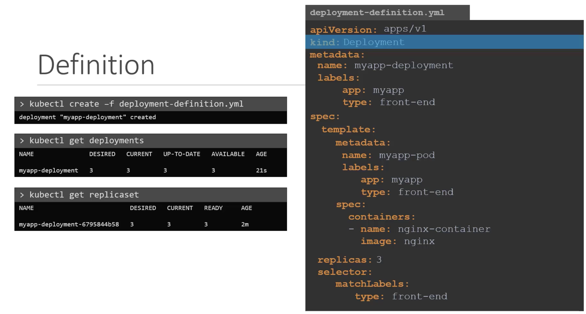

### commands
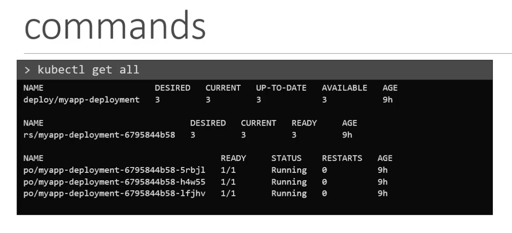


# 33. Certification Tip
### Making use of ‘kubectl run’

It is a bit difficult to create and edit YAML files. Especially in the CLI. During the exam, you might find it difficult to copy and paste YAML files from browser to terminal.

Using `kubectl run` facilitates this.

**Create an NGINX Pod**

`kubectl run nginx --image=nginx`

**Generate POD Manifest YAML file (-o yaml). Don't create it(--dry-run)**

`kubectl run nginx --image=nginx --dry-run=client -o yaml`

**Create a deployment**

`kubectl create deployment --image=nginx nginx`

**Generate Deployment YAML file (-o yaml). Don't create it(--dry-run)**

`kubectl create deployment --image=nginx nginx --dry-run=client -o yaml`

**Generate Deployment YAML file (-o yaml). Don’t create it(–dry-run) and save it to a file.**

`kubectl create deployment --image=nginx nginx --dry-run=client -o yaml > nginx-deployment.yaml`

**Make necessary changes to the file (for example, adding more replicas) and then create the deployment.**

`kubectl create -f nginx-deployment.yaml`

**OR**

**In k8s version 1.19+, we can specify the --replicas option to create a deployment with 4 replicas.**

`kubectl create deployment --image=nginx nginx --replicas=4 --dry-run=client -o yaml > nginx-deployment.yaml`

# 34. PracticeTest - Deployments

- **Problems**
    1. view pods → kubectl get pods
    2. view replsets → kubectl get replicaset
    3. view deployments → kubectl get deployment
    4. view deployment info → kubectl describe deployment
    5. problem: kind is lowercase ‘d’eployment
    6. problem: create my own deployment.
        
        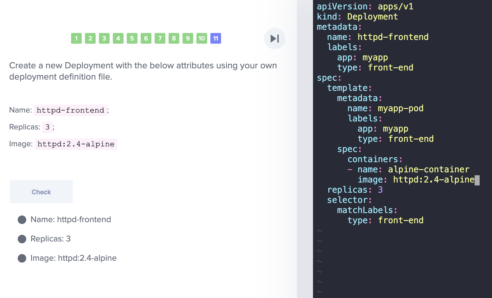
        
        ```yaml
        apiVersion: apps/v1
        kind: Deployment
        metadata:
          name: httpd-frontend
          labels: 
            app: myapp
            type: front-end
        spec: 
          template:
            metadata:
              name: myapp-pod
              labels: 
                app: myapp
                type: front-end
            spec: 
              containers:
              - name: alpine-container
                image: httpd:2.4-alpine
          replicas: 3
          selector:
            matchLabels: 
              type: front-end
        ```
        
    

# 35. Solutions (skip)

# 36. Services

Kube services enable communication between components inside and outside of the application. 

Kube services help us connect applications.  

### External Access

Kube node has an IP address 192.168.1.2

Laptop is on the same network.

Internal pod network is in range 10.244.0.0

Pod has IP 10.244.0.2

We could access the pod with a curl, but this accesses it from within the webserver, not the laptop.


That is, we don’t want to ssh into the server and just curl right away from the laptop.

The kube service helps with this.

### Service Types

NodePort: Service makes an internal port accessible on a port on the node.

ClusterIP: Service creates a virtual IP inside the cluster to enable communication between different services like a set of frontend servers to a set of backend servers.

LoadBalancer: Service makes a load balancer in supported cloud providers. 


NodePort

External access to the application by mapping a port on the node to a port on the Pod.


There are three ports involved:

Port 80: Port on the pod where the actual web server is running. (Target Port-That is where the service forwards their request to)

Port on the service itself: “The Port - viewpoint of the service”. The service is like a virtual server inside the node. It has its own IP address. 

NodePort: Port on the node itself. 


What about when we have multiple pods?

A: Service automatically selects all three pods.


On separate nodes on the cluster?

A: All three available on the same port 30008.


# 37. Services Cluster IP

### What is the right way to establish connectivity between servers?

The pods can go down any time, causing their IP addresses to be unreliable.

Kube provides a single interface to access all the redis systems as one, and all the back-end servers as one Cluster IP.


### How to define ClusterIPs?


# 38. LoadBalancer

Kubernetes can leverage with the native load balancers of certain cloud providers like AWS, GCP, or Azure.

# 39. PracticeTest-Services

How many services ? → `kubectl get service` 1 kube service is created at launch.

What is the type of the default `kubernetes` service? → ClusterIP

What is the targetPort? → `kubectl describe service kubernetes` 6443

Create web-service → `kubectl apply -f /root/service-definition-1.yaml`