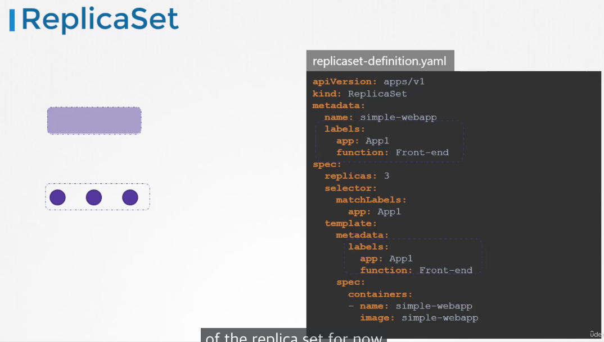

# Section 3: Scheduling

## 51. Scheduling Section Introduction
We look at all the options regarding how to modify scheduling.

## 53. Manual Scheduling
Every yaml file has a section called nodeName that by default is not set. The scheduler goes through all the pods and looks for those that do not have this property set.

Once it finds the node to schedule, it schedules it by binding the Pod to a node.
example:
`nodeName: node02`

So if there is no scheduler, the pods continue to be in a pending state. Therefore, we can manually assign the pods ourselves by specifying it in the nodeName. This is only possible at creation though. 

### What if we want to assign the pod to a node after creation.
Create a binding object and send a POST request to the pod's binding API, mimicking an actual scheduler. 

## 56. Labels and Selectors
We need the ability to filter, and that is possible with labels.

You could group objects by their type, their application, etc.

The labels in the template area are labels for the pods while the labels in the metadata are those for the replicaset.

The selector matchLabels must match the labels of the template to work.

### Annotations
Annotations are used to give details or information.

## 57. Test Labels
We have deployed a number of PODs. They are labelled with tier, env and bu. How many PODs exist in the dev environment (env)?

`kubectl get pods --selector env=dev`

How many objects are in the prod environment including PODs, ReplicaSets and any other objects?

`kubectl get all --selector env=prod`

Identify the POD which is part of the prod environment, the finance BU and of frontend tier?

`kubectl get pod --selector env=prod,bu=finance,tier=frontend`

A ReplicaSet definition file is given replicaset-definition-1.yaml. Attempt to create the replicaset; you will encounter an issue with the file. Try to fix it.

    The ReplicaSet "replicaset-1" is invalid: spec.template.metadata.labels: Invalid value: map[string]string{"tier":"nginx"}: `selector` does not match template `labels`

## 59. Taints and Tolerations
Several bugs are approaching a person. To prevent the bugs from approaching we can spray bug repellant (기피제) on the person.

In this analogy, the bug repellant is the **`taint`**.

Some bugs, say mosquitoes, are **`intolerant`** to the spray and therefore won't approach any further.

However some other bugs, say flies, are **`tolerant`** and will keep on approaching.

To determine whether a bug can approach or not, we need to determine two things:

1) The Taint
2) The bug's toleration level to the taint
---
In Kubernetes, the person is the node and the bugs are pods.
Bugs won't infect nodes or the like. Instead, taints and tolerations are set to determine which pods can be scheduled on a node.

If we want to use the nodes for specific purposes, we can place taints on them, thus restricting irrelevant pods from being scheduled.

If we want particular pods to be able to access the nodes, we provide tolerance to them. In this case, if we want pods D to be scheduled in node 1, we give them tolerance to the Blue Taint.

### How to set Taints
`kubectl taint nodes node-name key=value:taint-effect`

The three types of taint-effecs are: NoSchedule, PreferNoSchedule, and NoExecute

example:
`kubectl taint nodes node1 app=blue:NoSchedule`

### How to set Tolerations
To set up Tolerations in pods, we need to edit their yaml files under the spec:tolerations section.

### Master Node
Same as worker node but it also has the capabilities of hosting a pod, and it runs all the management software.

Best practice is to not deploy any application workloads on a master server.

To see this taint we can use:

`kubectl describe node kubemaster | grep Taint`

## 60. 
Create a taint on node01 with key of spray, value of mortein and effect of NoSchedule

`kubectl taint node node01 spray=mortein:NoSchedule`

Create a new pod with the nginx image and pod name as mosquito.

    apiVersion: v1
    kind: Pod
    metadata:
      name: mosquito
    spec:
      containers:
      - image: nginx
        name: mosquito

`kubectl create -f mosquito.yaml`

Create another pod named bee with the nginx image, which has a toleration set to the taint mortein.

    apiVersion: v1
    kind: Pod
    metadata:
      name: bee
    spec:
      containers:
      - image: nginx
        name: bee
      tolerations:
      - key: "spray"
        operator: "Equal"
        value: "mortein"
        effect: "NoSchedule"

`kubectl create -f bee.yaml`

Do you see any taints on controlplane node?

`kubectl describe node controlplane | grep Taint`

Remove the taint on controlplane, which currently has the taint effect of NoSchedule.

`kubectl taint nodes controlplane node-role.kubernetes.io/control-plane:NoSchedule-`

## 62. Node Selectors

In our current setup, any pods can go to any nodes. However, what if we want to send the heavier pods to the more resilient Nodes? The easiest way to combat this is to use Node Selectors.

We go into our pod-definition.yaml file and define spec:nodeSeletor: as size: Large. In this scenario 'Large' is merely a label which we will use to identify the large node. 

### Labeling Nodes
`kubectl label nodes <node-name> <label-key>=<label-value>`

`kubectl label nodes node-1 size=Large`

This works in simple cases but has limitations with more complex nodes such as large, medium, or NOT small.

## 63. Node Affinity
Node Affinity provides more complexity when limiting which pods go to which nodes. 

Both do the same thing.

The In operator ensures that the pod will be placed in a node whose label size has any value in the list of values provided.

If we were to want the pod to be able to go to medium sized nodes as well, we could only add '- Medium' and it should work.

We could also use the NotIn operator to avoid Small Nodes.

    - matchExpressions:
      - key: size
        operator: NotIn
        values:
        - Small

The Exists operator just checks if the label size exists on the nodes.

### What IF
However, what if there is no label called size during creation. These kind of what ifs are solved by the really long `requiredDuringSchedulingIgnoredDuringExecution`.

1. `requiredDuringSchedulingIgnoredDuringExecution`
2. `preferredDuringSchedulingIgnoredDuringExecution`
3. `requiredDuringSchedulingRequiredDuringExecution`

DuringScheduling: the pod does not exist and is first created.

*What if the nodes with matching labels are not available because we forgot to label them for example?*

Required DuringScheduling: 'FM'
 Preferred DuringScheduling: '열심히 하시잖아. 진행시켜'

## 64,65.

Apply a label color=blue to node node01

`kubectl label node node01 color=blue`

Create a new deployment named blue with the nginx image and 3 replicas.

`kubectl create deployment blue --image=nginx --replicas=3`

Which nodes can the pods be placed in? A:2

`kubectl describe node controlplane | grep taint` 
`kubectl describe node node01 | grep taint`

Set Node Affinity to the deployment to place the pods on node01 only.

`kubectl edit deployment blue`

